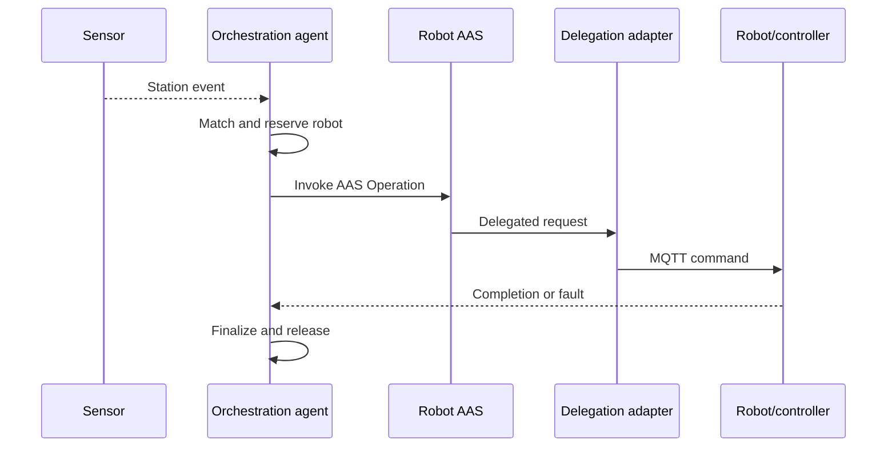

# BaSyx Operation Delegation for OPI Simulation

This setup uses BaSyx Operation Delegation to route operations selected by the
orchestration agent from AAS to simulation commands over MQTT.

## Purpose

The orchestration agent discovers capabilities in robot AAS submodels and
invokes the selected standardized AAS Operation. BaSyx forwards the call to the
HTTP endpoint configured in the operation qualifier. The delegated Spring Boot
service then publishes the controller-facing MQTT command for the OPI
simulation stack.

## Primary Runtime Architecture

```text
Sensor event
→ Python orchestration agent
→ AAS Operation invocation
→ operation-delegation-service
→ MQTT command
→ simulation robot/controller
→ MQTT completion or fault
→ Python orchestration agent
```



This is the official command path. The agent commands robots through AAS
Operations; MQTT is the implementation-level connection between the delegation
adapter and the controller.

## Delegation Endpoints in operation-delegation-service

Use these HTTP endpoints as operation delegation targets:

1. Conveyor running: /simulation/stations/{stationId}/conveyorbelt/run
2. Conveyor speed: /simulation/stations/{stationId}/conveyorbelt/speed
3. Robot MoveBox: /simulation/robot/movebox
4. Robot MoveToHome: /simulation/stations/{stationId}/robot/move-to-home
5. Generic station operation: /simulation/stations/{stationId}/operation/invoke

Base URL from other containers:

http://operation-delegation-service:8087

## MQTT Topic Contract

Configured in [operation-delegation-service/src/main/resources/application.yml](operation-delegation-service/src/main/resources/application.yml):

1. Topic template: simulation/{stationId}/operations/{operation}
2. Conveyor running topic: simulation/Station_01/operations/conveyorRunning
3. Conveyor speed topic: simulation/Station_01/operations/conveyorSpeed
4. Robot MoveBox topic example: simulation/Station_01/operations/moveBox

The simulation listener must subscribe to matching topics.

## AAS Operation Qualifier Example

Example qualifier for operation delegation:

```json
{
  "type": "invocationDelegation",
        "value": "http://operation-delegation-service:8087/simulation/stations/Station_01/conveyorbelt/speed"
}
```

MoveBox qualifier example:

```json
{
        "type": "invocationDelegation",
        "value": "http://operation-delegation-service:8087/simulation/robot/movebox"
}
```

Key points:

1. Qualifier type must be exactly invocationDelegation.
2. URL must be reachable from aas-env container.
3. AAS operation inputs are forwarded and parsed by the delegated service.
4. MoveBox expects `StationId`, `SourcePosition`, and `TargetPosition`.
5. `StationId` from the operation input is authoritative.

## Robot MoveBox Payload Contract

For MoveBox operation delegation, define these AAS input variables:

1. StationId (xs:string)
2. SourcePosition (xs:string)
3. TargetPosition (xs:string)

The delegated service publishes this MQTT message shape:

```json
{
        "requestId": "<generated-or-forwarded>",
        "stationId": "Station_01",
        "operation": "moveBox",
        "params": {
                "SourcePosition": "Conveyor1",
                "TargetPosition": "Pallet1"
        }
}
```

The simulation listener should resolve both positions within `StationId` and then execute:

1. Move to `SourcePosition`.
2. Pick.
3. Move to `TargetPosition`.
4. Release.

The station and both positions remain explicit throughout delegation.

## BaSyx Allowlist Requirement

BaSyx operation delegation target validation is enabled. Allowlist is configured in [basyx/aas-env.properties](basyx/aas-env.properties):

1. basyx.submodelrepository.feature.operation.delegation.security.allowlist.hosts=operation-delegation-service
2. basyx.submodelrepository.feature.operation.delegation.security.allowlist.ports=8087

Without this, delegation may fail with HTTP 424 and blocked private address errors.

## Quick Validation Steps

1. Start stack:

```powershell
docker compose --profile demo up -d
```

2. Test delegated endpoints directly:

```powershell
Invoke-RestMethod -Uri "http://localhost:8087/simulation/stations/Station_01/conveyorbelt/run" -Method Post -ContentType "application/json" -Body '{"running":true}'
Invoke-RestMethod -Uri "http://localhost:8087/simulation/stations/Station_01/conveyorbelt/speed" -Method Post -ContentType "application/json" -Body '{"speed":55.0}'
```

3. Invoke the operation from AAS Web UI and verify published MQTT messages.

4. Inspect logs when debugging:

```powershell
docker logs -f aas-env
docker logs -f operation-delegation-service
docker logs -f mosquitto
```

When the optional `mqtt-first` profile is enabled, inspect its adapter
separately with `docker logs -f mqtt-operation-bridge`.

## Optional MQTT-First Adapter

The bridge service in
[mqtt-operation-bridge/README.md](mqtt-operation-bridge/README.md) is intended
for external systems that already issue MQTT commands. It is not required by
the primary agent architecture.

```text
External MQTT command
→ mqtt-operation-bridge
→ AAS Operation invocation
→ operation-delegation-service
→ MQTT command
→ controller
```

The bridge listens to `oip/command/{stationId}/{action}`, invokes the
station-specific AAS Operation, and publishes its interoperability reply under
`oip/reply/{stationId}/{operation}`. Enable it explicitly:

```powershell
docker compose --profile mqtt-first up -d
```

Do not interpret the MQTT-first input and the controller-facing MQTT output as
one circular command flow. They are separate boundaries used only when an
external MQTT producer activates the optional adapter.

## Troubleshooting

1. HTTP 424 from AAS invoke:
   Delegation target was blocked, unreachable, or returned a downstream error. Check allowlist and service logs.

2. HTTP 404 from delegated invocation:
   Endpoint path in invocationDelegation qualifier does not match service route. Recheck URL path.

3. HTTP 200 from delegated service but simulation did not change state:
   MQTT topic contract mismatch. Confirm stationId and operation names match subscriber expectations.

4. Changes not reflected after code update:
   Rebuild service image:

```powershell
docker compose up -d --build operation-delegation-service
```

For the optional bridge, include its profile:

```powershell
docker compose --profile mqtt-first up -d --build mqtt-operation-bridge
```

## Related Files

1. [README.md](README.md)
2. [docker-compose.yml](docker-compose.yml)
3. [basyx/aas-env.properties](basyx/aas-env.properties)
4. [operation-delegation-service/src/main/resources/application.yml](operation-delegation-service/src/main/resources/application.yml)
5. [mqtt-operation-bridge/README.md](mqtt-operation-bridge/README.md)
