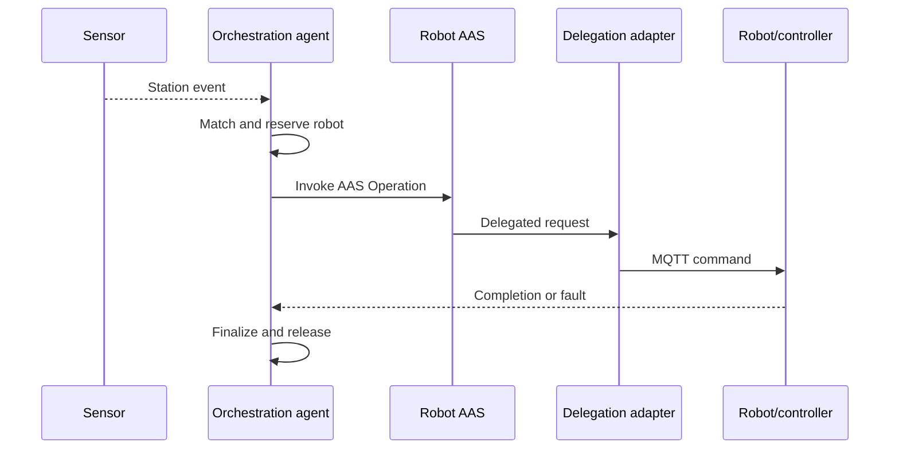

# BaSyx Setup for OPI Simulation

This folder contains the Docker-based BaSyx setup used for agent-driven OPI
Simulation with AAS Operation delegation.

Prerequisite: Docker Desktop (or Docker Engine with Compose plugin) is installed.

## Architecture

### Primary command path

The central orchestration agent receives station events, matches the requested
job against robot capabilities described in AAS submodels, reserves the
selected robot, and invokes its AAS Operation. The operation-delegation service
translates the AAS invocation into the controller-facing MQTT command.
Completion and fault messages are correlated with the lifecycle using the
request ID.

```text
Sensor event
→ Python orchestration agent
→ AAS Operation invocation
→ operation-delegation-service
→ MQTT command
→ simulation robot/controller
→ MQTT completion or fault
→ Python orchestration agent
```



The agent-to-AAS direction is the official command path for this demonstrator.
MQTT is the implementation-level controller interface after the standardized
AAS Operation has been selected and invoked.

### Optional adapters

The demonstrator also includes adapters for systems that enter through other
industrial interfaces. These are interoperability options and are not part of
the normal primary execution sequence
| Adapter | Use case | Required for primary architecture? |
|---|---|---:|
| AAS-to-MQTT delegation | Connect AAS Operations to the simulated/controller interface | Yes |
| MQTT-to-AAS bridge | Allow existing MQTT producers to invoke operations through the AAS | No |
| OPC UA adapter | Connect PLC/controller environments where OPC UA is preferred | No; not used by the current primary path |

The optional MQTT-first route is:

```text
External MQTT command
→ mqtt-operation-bridge
→ AAS Operation invocation
→ operation-delegation-service
→ MQTT command
→ controller
```

Use this route only when an external system already produces MQTT commands and
cannot initially use the agent/AAS entry point. It does not run alongside the
primary path as a required return channel.

## Configuration

Secrets are not stored in source control. Before starting the stack, create a .env file in this folder:

```
copy .env.example .env
```

Then edit .env and set values:

| Variable | Description |
|---|---|
| `MONGO_PASSWORD` | Password for the MongoDB `mongoAdmin` user |
| `OPCUA_ACCESS_CODE` | Legacy variable from earlier OPC UA flow. It is not used by the current simulation MQTT delegation path. |

The .env file is excluded from git via .gitignore.

## Deployment Modes

1. Clone or extract the repository on your device.
2. Create and populate .env as described above.
3. Open a terminal and navigate to the folder.

The default Compose deployment is the execution-only `edge-minimal` mode.
The `demo` profile adds presentation and diagnostic services.

| Mode | Activation | Purpose |
|---|---|---|
| `edge-minimal` | Default, no profile required | Smallest stack that executes the primary command path |
| `demo` | `demo` profile | Adds the AAS Web UI, dashboard API, and AAS discovery |

Start only the execution components:

```powershell
docker compose up -d
```

Start the full demonstrator:

```powershell
docker compose --profile demo up -d
```

The MQTT-first bridge remains a separate add-on. Enable it only when testing an
external MQTT producer:

```powershell
docker compose --profile mqtt-first up -d
```

## Available Services

Execution services included in both modes:

- AAS Environment: [http://localhost:8081](http://localhost:8081)
- AAS Registry: [http://localhost:8082](http://localhost:8082)
- Submodel Registry: [http://localhost:8083](http://localhost:8083)
- Operation Delegation Service: [http://localhost:8087](http://localhost:8087)
- Mosquitto MQTT Broker: localhost:1883
- Python Agent: background worker (no public HTTP port)
- MQTT-to-AAS telemetry bridge: background worker (no public HTTP port)

Additional `demo` services:

- AAS Discovery: [http://localhost:8084](http://localhost:8084)
- AAS Web UI: [http://localhost:3000](http://localhost:3000)
- Dashboard API: [http://localhost:8085](http://localhost:8085)

Optional profile service:

- MQTT Operation Bridge: [http://localhost:8091](http://localhost:8091),
  enabled by the `mqtt-first` profile

## Python Agent (Event-Driven Robot Orchestration)

The python-agent listens to AAS submodel update events and dispatches robot operations dynamically from robot capability metadata.

Current behavior:

1. Subscribes to AAS update events and correlated operation replies on `simulation/+/replies/+`.
2. Processes boolean sensor properties whose idShort contains Present or Clear.
3. Enqueues a job on valid detection and routes it to a robot by matching TriggerSensor -> TargetOperation in SupportedCapabilities.
4. Latches runtime state by station and correlates commands with their `requestId`.
5. Rearms a station only after its operation reports `completed` and its sensor reports `false`.
6. Polls `IsMoving` as a diagnostic/compatibility monitor.
7. Publishes retained robot fault-state transitions to
   `factory/robots/<robotId>/fault` for external subscribers.

Key python-agent environment variables (see [docker-compose.yml](docker-compose.yml)):

1. BASYX_BASE_URL
2. MQTT_HOST / MQTT_PORT / MQTT_TOPIC / OPERATION_REPLY_TOPIC /
   ROBOT_FAULT_TOPIC_PREFIX
3. STATION_REGISTRY_FILE
4. JOB_TIMEOUT_SECONDS / INVOKE_RETRY_COUNT

The registry variable points to the shared `stations.json` file in the default
Compose setup.

## Add a Station

[stations.json](stations.json) is the canonical runtime registry used by the
simulation manifest publisher, telemetry bridge, MQTT operation bridge, and
orchestrator. Station identifiers are explicit and may use any name; there is
no positional or `station_01`/`station_02` inference.

To add a station:

1. Add one entry below `stations` with a unique `stationId` and the station's
   conveyor telemetry, conveyor operations, robot state, and robot skills
   submodel IDs.
2. Add or upload the corresponding conveyor AASX. Add a robot AASX only when the
   station introduces a new robot.
3. Add a `SupportedCapabilities` route for the station to a robot skills
   submodel.
4. Add the station to the OIP scene and map its OPC UA tags.
5. Restart `server.py` and `python-agent`, which cache registry data. Restart
   `mqtt-operation-bridge` as well only when the `mqtt-first` profile is in use.

When `STATION_IDS` is unset, `server.py` creates every station declared in the
registry. Set `STATION_IDS` to a comma-separated subset to run only selected
stations.

## Include Your Own Asset Administration Shells

To include your own AAS packages, either:

1. Put AASX files in the aas folder.
2. Upload them via AAS Web UI.

For operation delegation details, see [README-OPERATION-DELEGATION.md](README-OPERATION-DELEGATION.md).
