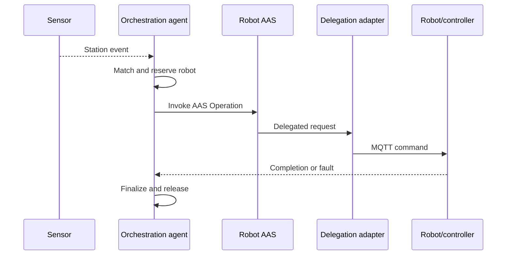

# BaSyx Setup for OPI Simulation

This folder contains the Docker-based BaSyx setup used for agent-driven OPI
Simulation with AAS Operation delegation.

Prerequisite: Docker Desktop (or Docker Engine with Compose plugin) is installed.

## Architecture

### Primary command path

The central orchestration agent receives semantic AAS state events, resolves a
ProcessRequirement, matches it against capabilities described in AAS submodels, reserves the
selected robot, and invokes its AAS Operation. The operation-delegation service
translates the AAS invocation into the controller-facing MQTT command.
Completion and fault messages are correlated with the lifecycle using the
request ID.

```text
Sensor event
→ Python orchestration agent
→ AAS Operation invocation
→ operation-delegation-service
→ MQTT command
→ simulation robot/controller
→ MQTT completion or fault
→ Python orchestration agent
```



The agent-to-AAS direction is the official command path for this demonstrator.
MQTT is the implementation-level controller interface after the standardized
AAS Operation has been selected and invoked.

### Optional adapters

The demonstrator also includes adapters for systems that enter through other
industrial interfaces. These are interoperability options and are not part of
the normal primary execution sequence
| Adapter | Use case | Required for primary architecture? |
|---|---|---:|
| AAS-to-MQTT delegation | Connect AAS Operations to the simulated/controller interface | Yes |
| MQTT-to-AAS bridge | Allow existing MQTT producers to invoke operations through the AAS | No |
| OPC UA adapter | Connect PLC/controller environments where OPC UA is preferred | No; not used by the current primary path |

The optional MQTT-first route is:

```text
External MQTT command
→ mqtt-operation-bridge
→ AAS Operation invocation
→ operation-delegation-service
→ MQTT command
→ controller
```

Use this route only when an external system already produces MQTT commands and
cannot initially use the agent/AAS entry point. It does not run alongside the
primary path as a required return channel.

## Configuration

Secrets are not stored in source control. Before starting the stack, create a .env file in this folder:

```
copy .env.example .env
```

Then edit .env and set values:

| Variable | Description |
|---|---|
| `MONGO_PASSWORD` | Password for the MongoDB `mongoAdmin` user |
| `OPCUA_ACCESS_CODE` | Legacy variable from earlier OPC UA flow. It is not used by the current simulation MQTT delegation path. |

The .env file is excluded from git via .gitignore.

## Deployment Modes

1. Clone or extract the repository on your device.
2. Create and populate .env as described above.
3. Open a terminal and navigate to the folder.

The default Compose deployment is the execution-only `edge-minimal` mode.
The `demo` profile adds presentation and diagnostic services.

| Mode | Activation | Purpose |
|---|---|---|
| `edge-minimal` | Default, no profile required | Smallest stack that executes the primary command path |
| `demo` | `demo` profile | Adds the AAS Web UI, dashboard API, and AAS discovery |

Start only the execution components:

```powershell
docker compose up -d
```

Start the full demonstrator:

```powershell
docker compose --profile demo up -d
```

The MQTT-first bridge remains a separate add-on. Enable it only when testing an
external MQTT producer:

```powershell
docker compose --profile mqtt-first up -d
```

## Available Services

Execution services included in both modes:

- AAS Environment: [http://localhost:8081](http://localhost:8081)
- AAS Registry: [http://localhost:8082](http://localhost:8082)
- Submodel Registry: [http://localhost:8083](http://localhost:8083)
- Operation Delegation Service: [http://localhost:8087](http://localhost:8087)
- Mosquitto MQTT Broker: localhost:1883
- Python Agent: background worker (no public HTTP port)
- MQTT-to-AAS telemetry bridge: background worker (no public HTTP port)

Additional `demo` services:

- AAS Discovery: [http://localhost:8084](http://localhost:8084)
- AAS Web UI: [http://localhost:3000](http://localhost:3000)
- Dashboard API: [http://localhost:8085](http://localhost:8085)

Optional profile service:

- MQTT Operation Bridge: [http://localhost:8091](http://localhost:8091),
  enabled by the `mqtt-first` profile

## Python Agent (Event-Driven Robot Orchestration)

The python-agent listens to AAS submodel update events and dispatches robot operations dynamically from robot capability metadata.

Current behavior:

1. Discovers AAS and Submodel descriptors from both Registries and builds an
   atomic `SemanticCatalog` snapshot.
2. Interprets boolean state updates through the discovered element
   `semanticId`; idShort is only an address within the Submodel.
3. Resolves `(trigger globalAssetId, trigger semanticId)` to a
   `ProcessRequirement`, then performs exact capability, reachability, cached
   state, and atomic reservation filtering.
4. Resolves capability -> Skill -> Operation and maps source/target arguments
   using Operation-variable semantics before invoking BaSyx `/invoke`.
5. Correlates completion by `requestId`, releases the selected resource, and
   rearms a trigger only after its semantic state becomes false.
6. Rebuilds the catalog every `REGISTRY_REFRESH_SECONDS` and swaps the complete
   snapshot atomically, so newly registered compatible resources require no
   python-agent restart or configuration entry.

The simulation telemetry boundary uses canonical AAS identities. OIP publishes
events to `oip/telemetry` with `assetId`, `semanticId`, and `value`; the
MQTT-to-AAS bridge discovers the owning Property and its Registry-advertised
Submodel endpoint. Neither the bridge nor the python-agent interprets station,
asset, signal, Submodel, or Property names.

Key python-agent environment variables (see [docker-compose.yml](docker-compose.yml)):

1. `AAS_REGISTRY_URL` / `SUBMODEL_REGISTRY_URL` /
   `REGISTRY_REFRESH_SECONDS`
2. `MQTT_HOST` / `MQTT_PORT` / `MQTT_TOPIC` /
   `OPERATION_REPLY_TOPIC`
3. `HTTP_TIMEOUT_SECONDS` / `OPERATION_TIMEOUT_SECONDS` /
   `INVOKE_RETRY_COUNT`
4. `ORCHESTRATOR_LOG_CSV_PATH` / `MEASUREMENT_RUN_ID`

The python-agent and MQTT-to-AAS bridge have no `BASYX_BASE_URL` or
`STATION_REGISTRY_FILE`: all AAS repository endpoints come from Registry
descriptors.

## Asset Registry

[stations.json](stations.json) is a legacy integration registry used only by
the optional `mqtt-first` MQTT operation compatibility bridge. It is not part
of the default semantic telemetry or orchestration paths. Schema version 2
separates `stations`, `robots`, and `conveyors`. The `stationAssets` list links
robots and conveyors to their physical stations using only `stationId`,
`assetType`, and `assetId`. Robot-to-station operation eligibility is separate:
it comes from the routes in each robot's `SupportedCapabilities` Skills AAS.

To add assets:

1. Add each station once below `stations`.
2. Add each robot once below `robots`, with its state and skills submodel IDs.
3. Add each conveyor once below `conveyors`, with its state and operations
   submodel IDs.
4. Link each robot and conveyor to its physical station in `stationAssets`.
5. Model Offered capabilities, CapabilityRealizedBy, CanReach, and
   SkillInvokedByOperation in each resource AAS.
6. Add or upload the corresponding AASX packages and map the assets in OIP.
7. Restart the optional legacy operation bridge only when its adapter mappings
   change. The semantic telemetry bridge and python-agent discover compatible
   AAS resources on their next refresh.

`server.py` currently represents one simulated robot and conveyor controller
per station. The separated registry and telemetry paths support independently
identified assets, while simulating several physical controllers inside one
station requires a corresponding OIP scene/controller model.

### Dynamic Robot02 onboarding check

1. Start the stack with Factory, Conveyor01, and Robot01 registered.
2. Upload/register a Robot02 AAS while python-agent remains running. Robot02
   must offer the same Transport semantic, relate it to a Skill, declare
   CanReach relationships to Conveyor01 and Pallet01, bind the Skill to an
   Operation, and expose semantic source/target input variables.
3. Wait one `REGISTRY_REFRESH_SECONDS` interval and check for
   `semantic resource added: globalAssetId=... offeredCapabilities=[...]` in
   `docker compose logs python-agent`.
4. Make Robot01 busy/unavailable or otherwise apply the stable-first policy,
   then produce the next false -> true WorkpiecePresent transition. Robot02 is
   selected without editing `stations.json`, changing Python, adding an agent,
   or restarting python-agent.

Phase 3 semantic telemetry is station-independent. The bridge routes
`(globalAssetId, semanticId)` directly to a discovered AAS Property, including
heterogeneous and nested `idShort` paths. Registration and removal are applied
without a bridge restart.

The Java operation-delegation/device adapter translates canonical source and
target identities to OIP node and station names through its
`simulation.identity` configuration. Python does not perform that translation:
it maps canonical values to the actual semantically declared Operation
variables and includes their semantic references in the BaSyx `/invoke`
payload. Local-name compatibility therefore stays below the AAS Operation
boundary.

## Include Your Own Asset Administration Shells

To include your own AAS packages, either:

1. Put AASX files in the aas folder.
2. Upload them via AAS Web UI.

For operation delegation details, see [README-OPERATION-DELEGATION.md](README-OPERATION-DELEGATION.md).
